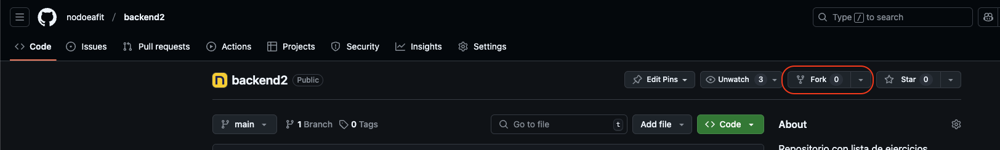
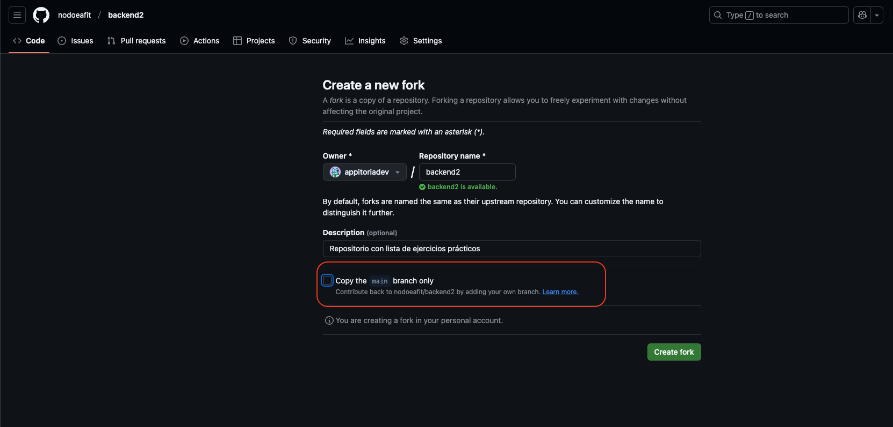

# Módulo BackEnd II [.Net]
> **[Nodo - EAFIT](https://es.nodoeafit.com/)**

En este repositorio encontrarás una lista de ejercicios prácticos para el módulo de Backend II.
Cada ejercicio tendrá una dificultad diferente para que vayas escalando, aprendiendo y creando.

[más información](./Info/info.md)

## **Instrucciones para el estudiante**

Para trabajar en este repositorio deberan realizar un `FORK` directamente en su propio repositorio y trabajar en un repositorio por ejercicio. La intención de realizar un `FORK` es para que siempre tengas las instrucciones y ejercicios a mano.

### 1. 

### 2.

## Menú de navegación.

Los siguientes contenidos son complementos para el módulo de Backend II de Nodo - Eafit.

1. Unidad 1: Fundamentos de .NET y C#

    a. Tema  1: Introducción a .NET y C#

    b. Tema  2: Programación Orientada a Objetos (POO) en C#

2. Unidad 2: Desarrollo de APIs con ASP.NET

    a. Tema  3: ASP.NET y Arquitectura de Aplicaciones Backend

    b. Tema  4: Entity Framework Core y Bases de Datos

3. Unidad 3: Seguridad y Buenas Prácticas

    a. Tema  5: Seguridad y Autenticación con Identity Framework

    b. Tema  6: Pruebas Unitarias e Integración

4. Unidad 4: Infraestructura y Despliegue*

    a. Tema  7: Docker y Contenerización

    b. Tema  8: Orquestación con Docker Compose

5. Unidad 5: Automatización y Producción

    a. Tema  9: Monitoreo y Logging

    b. Tema  10: CI/CD con GitHub Actions

    c. Tema  11: Despliegue en la Nube
